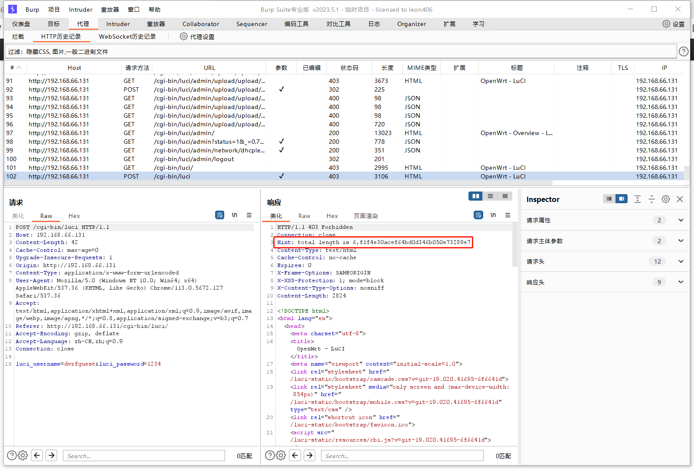
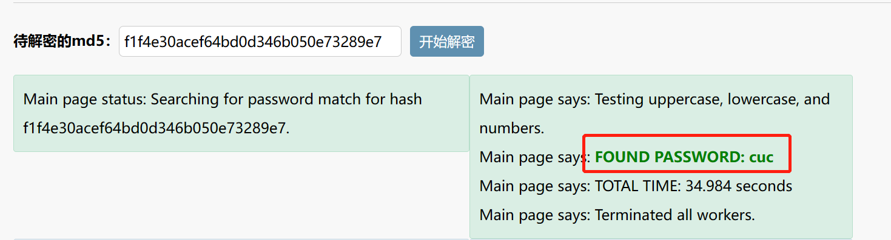
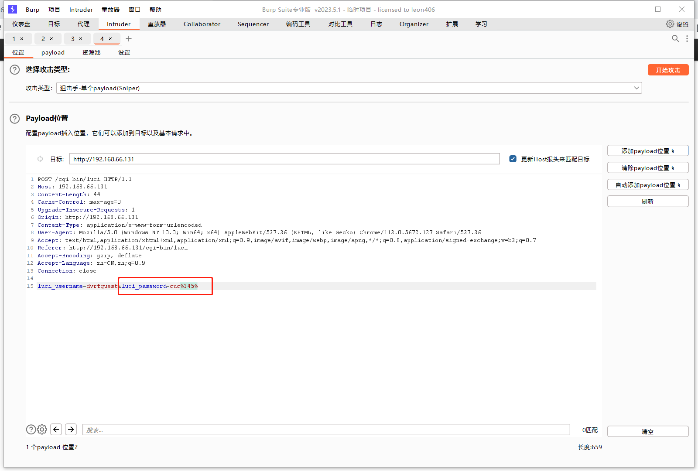
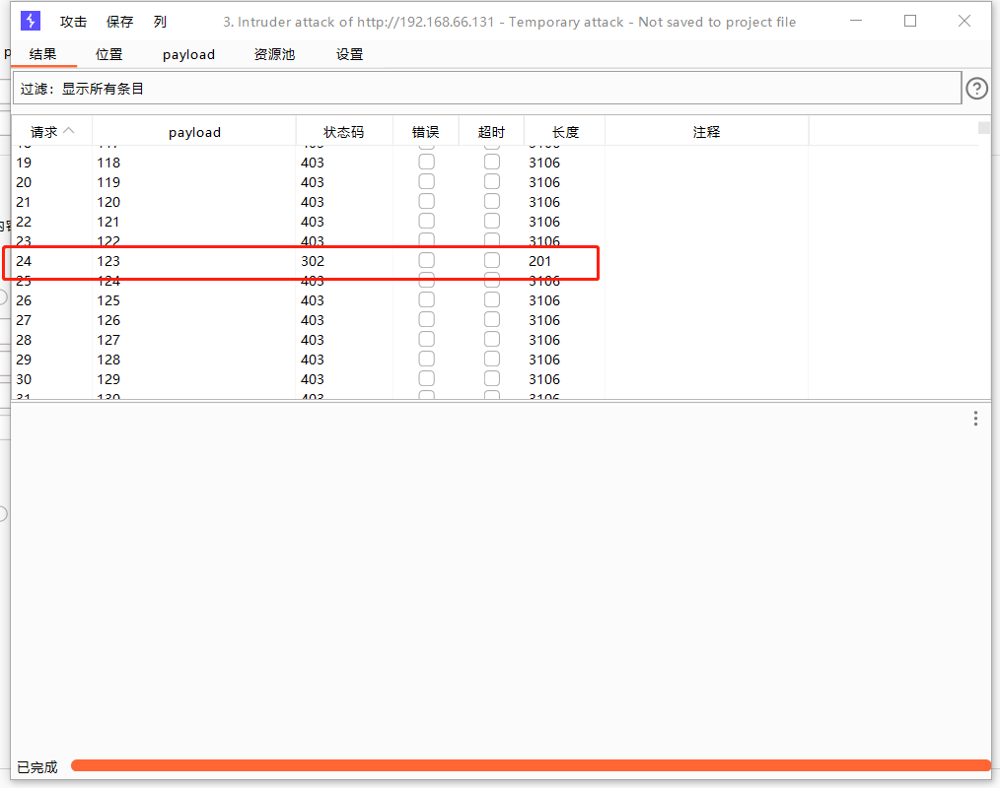
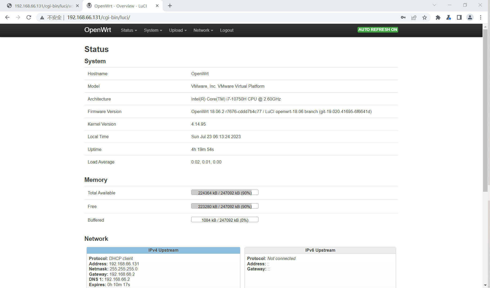

### write up

* 随意输入密码，burpsuite抓包获得提示

* 确定密码是六位，获得一串密文：`totallengthis6,f1f4e30acef64bd0d346b050e73289e7`，攻击者后续通过对`f1f4e30acef64bd0d346b050e73289e7`进行MD5解密得到前缀`cuc`：

* 猜测密码`cuc345`，再次抓包，将截获的报文发送至intruder，payload选中`345`，进行爆破：

* 获得后三位密码：

* 登陆成功：

